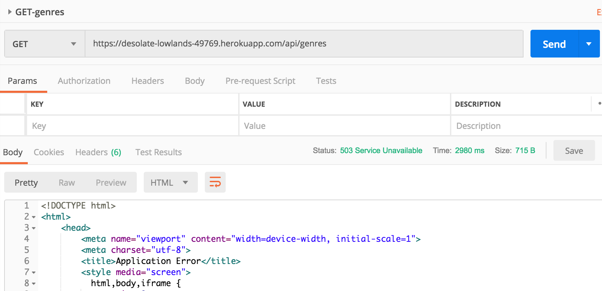
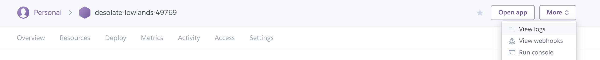
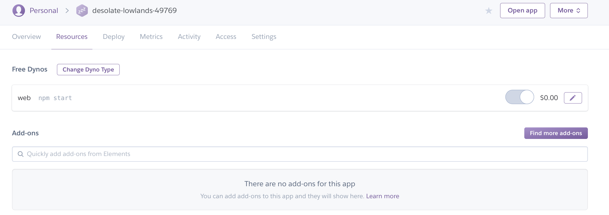
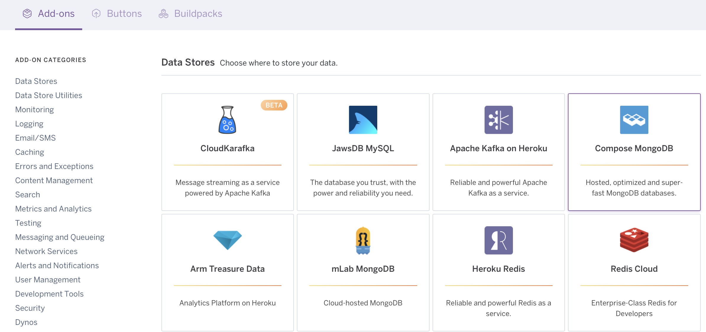
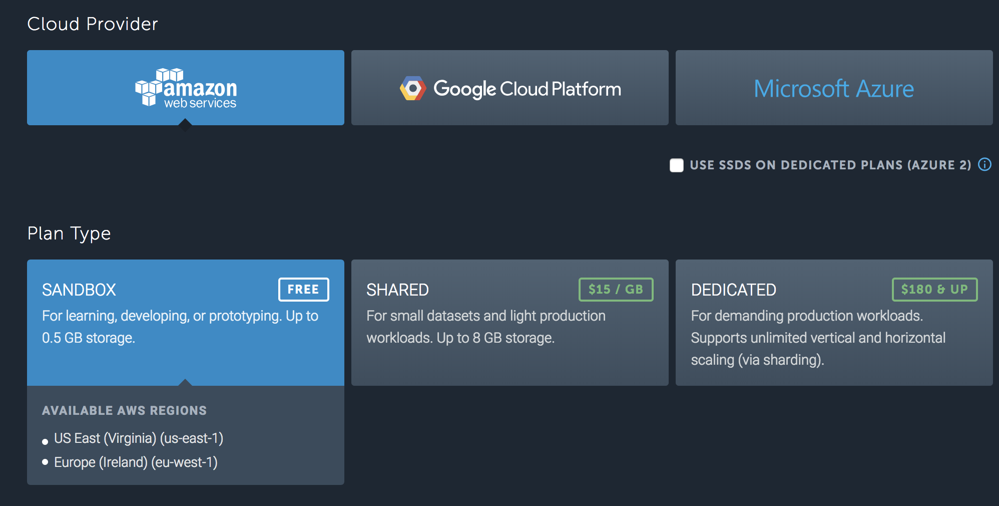
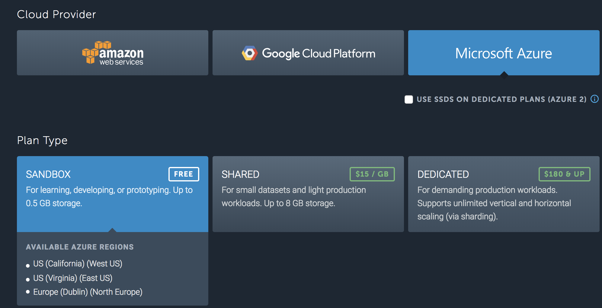
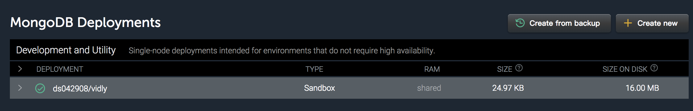
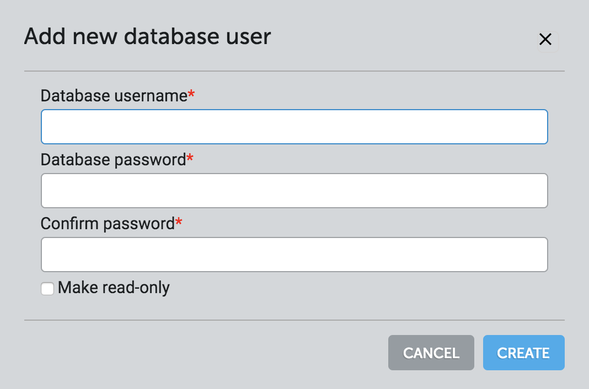
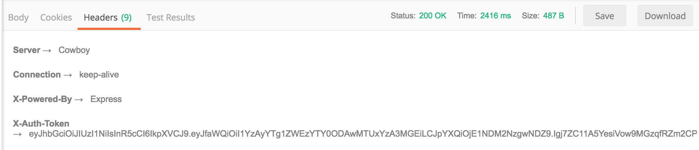
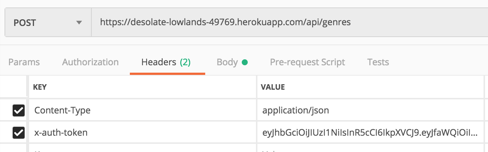

# Deploying Node Applications

## Content
- [Introduciton](#Introduciton)
  - [PaaS](#PaaS)
  - [Docker](#Docker)
- [Preparing the App for Production](#Preparing-the-App-for-Production)
- [Getting Start with Heroku](#Getting-Start-with-Heroku)
  - [Install Heroku CLI](#Install-Heroku-CLI)
- [Preparing the App for Deployment](#Preparing-the-App-for-Deployment)
- [Adding the Code to a Git Repository](#Adding-the-Code-to-a-Git-Repository)
- [Deploying to Heroku](#Deploying-to-Heroku)
- [Viewing Logs](#Viewing-Logs)
- [Setting Environment Variables](#Setting-Environment-Variables)
- [MongoDB in the Cloud](#MongoDB-in-the-Cloud)

## Introduciton

Basically you have two options for deploying a Node application. 

- PaaS: platform as a service provider
- Docker

### PaaS
The platform as a service provider is a great option if you don't want to get involved with infrastructures. If you don't want to worry about servers, load balancers, reverse proxies, or restarting your application on a crash, then a platform as a service provider is your best friend. There are quite a few options in this space, such as **Heroku**, **Google Cloud Platform**, **AWS**, **Azure**, and so on.

### Docker

In contrast, if you want to have more control over your deployment and deploy your Node applications to your own web servers, then **Docker** is a great option. With Docker, you can easily create an image of your application and simply deploy that image to any computers you want.

## Preparing the App for Production

So, we're going to install a couple of packages. The first one is **helmet**.

```shell
$ npm i helmet
```

**Helmet** is a middleware package that can protect your application from well-known web vulnerabilities.

The other package we're going to install is **compression**, and we use that to compress the HTTP response that we send to the client.

```shell
$ npm i compression
```

Under _startup_ folder, create a file called _prod.js_. All the middlewares that we need to install for a **production environment** will be added here. 

Just like our other startup modules, we want to export a function. This function should take our application object (_app_) because we're going to use this to install these middleware pieces.

_prod.js_
```js
const helmet = require('helmet');
const compression = require('compression');

module.exports = function (app) {
  app.use(helmet());  // helmet() is a function that we need to call in order to get a middleware function
  app.use(compression());
}

```

_index.js_

```js
// added
require('./startup/prod')(app);
```

Here we can also write code to conditionally load the _prod_ module if we are in the production environment, but it doesn't really matter.

## Getting Start with Heroku

### Install Heroku CLI

Search "Heroku CLI" with google, and you will find the installation instruction.

For **Mac**
```shell
$ brew install heroku/brew/heroku
```

To check the version that you have installed,

```shell
$ heroku -v
```

Longin to Heroku with CLI,

```shell
$ heroku login
```

Now chances are this step may fail on your machine if you're behind a fire wall, which requires the use of a proxy to connect with external HTTP services. If that's the case, you need to set an environment variable.

```shell
$ export HTTP_PROXY=http://proxy.server.com:1234
```

Once you set that, try logging in with "heroku login" one more time.

## Preparing the App for Deployment

When we deploy our application to Heroku, Heroku will start our application by running the command, **npm start**. So, we need to define the **start** script in _package.json_.

_package.json_

```json
  "scripts": {
    "start": "node index.js"
  },
```

In production we're not going to use **nodemon**, which is purely for development. We used **nodemon** to watch those changes, and restart our application automatically.

Now, there is one more change we need to make to package.json to prepare our application to be deployed to Heroku. We add a new property **engines** where we define the version of node we are using.

```json
  "engines": {
    "node": "8.11.1"
  },
```

With these two simple changes, our application is now ready to be deployed to Heroku.

## Adding the Code to a Git Repository

Before we can deploy this application to Heroku, we need to add our source code inside of a **Git** repository. Make you have installed Git properly.

```shell
$ git --version
```

Now in our project folder, we need to run the following three commands:

```shell
$ git init
```

Now before we run the second command, we need to go back to VS Code and add a new file in the root of our project.

**.gitignore**

```
node_modules/
coverage/
.vscode/
.DS_Store
logfile.log
uncaughtExceptions.log
```

Back to the terminal:

```shell
$ git add .
$ git commit -m "First commit."
```

## Deploying to Heroku

With our source code under a Git repository, now we can use the Heroku CLI to deploy our application. So, here in the terminal in the project folder:

```shell
$ heroku create
```

This command does two things:
- First, it creates an application in Heroku
- Second, it creates a **Git Remote** in our local git environment.

Now every time we modify our code and commit the changes to our repository, these changes, the updated source code, are in our local Git repository. Later, we can **push** our changes from this local repository, to a different repository like the one we have in Heroku, and then **Heroku will automatically download the latest code from that repository and install our application**. 

After you send this command, Heroku will create a unique name for your application, such as

```
desolate-lowlands-49769
```

And here is the address of our application on Heroku:

```
https://desolate-lowlands-49769.herokuapp.com/
```

And next to that, you can see the address of the remote git repository:

```
https://git.heroku.com/desolate-lowlands-49769.git
```

Now in this folder if you run

```shell
$ git remote -v
```

you can see the list of remote repositories.

```shell
heroku	https://git.heroku.com/desolate-lowlands-49769.git (fetch)
heroku	https://git.heroku.com/desolate-lowlands-49769.git (push)
origin	https://github.com/allguitars/NodeJS-Demo.git (fetch)
origin	https://github.com/allguitars/NodeJS-Demo.git (push)
```

Now, we can deploy our application with one command:

```shell
$ git push heroku master 
```

During the process, you can see we can see Heroku is installing binaries, in this case, the engine that we specified which is node version 8.11.1. After that, it's installing our dependencies, node modules, and finally you can see our application is deployed to Heroku.

```shell
➜  movie-project git:(master) git push heroku master
Enumerating objects: 6, done.
Counting objects: 100% (6/6), done.
Delta compression using up to 4 threads.
Compressing objects: 100% (4/4), done.
Writing objects: 100% (4/4), 1.86 KiB | 1.86 MiB/s, done.
Total 4 (delta 2), reused 0 (delta 0)
remote: Compressing source files... done.
remote: Building source:
remote:
remote: -----> Node.js app detected
remote:
remote: -----> Creating runtime environment
remote:
remote:        NPM_CONFIG_LOGLEVEL=error
remote:        NODE_ENV=production
remote:        NODE_MODULES_CACHE=true
remote:        NODE_VERBOSE=false
remote:
remote: -----> Installing binaries
remote:        engines.node (package.json):  8.11.1
remote:        engines.npm (package.json):   unspecified (use default)
remote:
remote:        Resolving node version 8.11.1...
remote:        Downloading and installing node 8.11.1...
remote:        Using default npm version: 5.6.0
remote:
remote: -----> Restoring cache
remote:        - node_modules
remote:
remote: -----> Building dependencies
remote:        Installing node modules (package.json + package-lock)
remote:        up to date in 6.336s
remote:
remote: -----> Caching build
remote:        - node_modules
remote:
remote: -----> Pruning devDependencies
remote:        Skipping because npm 5.6.0 sometimes fails when running 'npm prune' due to a known issue
remote:        https://github.com/npm/npm/issues/19356
remote:
remote:        You can silence this warning by updating to at least npm 5.7.1 in your package.json
remote:        https://devcenter.heroku.com/articles/nodejs-support#specifying-an-npm-version
remote:
remote: -----> Build succeeded!
remote: -----> Discovering process types
remote:        Procfile declares types     -> (none)
remote:        Default types for buildpack -> web
remote:
remote: -----> Compressing...
remote:        Done: 31.5M
remote: -----> Launching...
remote:        Released v8
remote:        https://desolate-lowlands-49769.herokuapp.com/ deployed to Heroku
remote:
remote: Verifying deploy.... done.
To https://git.heroku.com/desolate-lowlands-49769.git
   58324a2..19fdd2c  master -> master
```

Now, open up Postman, paste the address and send a GET request to /api/genres. We got an error:

**503 Service Unavailable**



## Viewing Logs

To dianose why our application crashed, we can look at Heroku logs here in the terminal, or we can look at our dashboard. 

In Terminal:

```shell
$ heroku logs
```

In this we can see **Winston** reporting the error message in the console:

```
...
'Error: FATAL ERROR: jwtPrivateKey is not defined.',

...

```

If you don't like looking at the logs in the terminal, you can log into your dashboard.



Now for some reason, we don't have that message here in this log file. So that's why I personally prefer to use the terminal to look at the logs, but you can try both approaches and see which approach is better to diagnose the problem.

Now one thing we need to clarify here, this log file that we have here in Heroku is different from the logging system that we set up in our application. Earlier, we set up Winston to log unhandled exceptions in this file, _UncaughtExceptions.log_. **This is a log that belongs to our application, not Heroku**.

Now if you want to look at this file, there are two ways. You can either use the SSH protocol to connect directly to Heroku's sever, which is also called **Heroku dyno**. The other option is to come back herein the dashboard, click more, and click **run console** to connect to your dyno or server. Now you have the terminal that allows you to see your files just like what you can do on your local machine.

In the console, you can type the following command to see the log.
```shell
$ cat uncaughtExceptions.log
```

This is how we diagnose problems in Heroku. Now, the reason our application crashed is that we have not defined this environment variable.

## Setting Environment Variables

We can set an environment variables using Heroku CLI.

```shell
$ heroku config:set vidly_jwtPrivateKey=1234
```

We're also going to set the node environment to _production_, and this is for improving performance and generating less verbose messages.

```shell
$ heroku config:set NODE_ENV=production
```

To see all the environment variables that we have set:

```shell
$ heroku config

=== desolate-lowlands-49769 Config Vars
NODE_ENV:            production
vidly_jwtPrivateKey: 1234

```

One thing you need to know about the cloud architecture in Heroku. In Heroku, by default, we have one server  which we call a **dyno**. If you want to scale your application you will add more dynos. These dynos have a temporary file system so every time they're restarted, their file system is wiped out. That's why you can't store anything in their file system.

So, if you want to use storage, there are various add-ons for storing different kinds of data. 

The only thing that these servers for these dino's share is these environment variables. So if you have 10 dynos, you don't need to explicitly set these environment variables on each dyno. You set them at the application level, and Heroku will automatically replicate these across all dynos. Now, we have set these environment variables, and every time there is a change in the value of these, Heroku will automatically restart our application.

Now, let's go back to the log, we see another error:

```shell

'MongoNetworkError: failed to connect to server'

```

The reason for this is because we set our **connection string** to an instance of mongoDB running on localhost. 

_default.json_
```json
{
  "db": "mongodb://localhost/vidly"
}
```

But obviously when we deploy this application to Heroku, there is no mongoDB there by default.

## MongoDB in the Cloud

In the dashboard, go to the _resources_ tab, here we can see add-ons. By default, the applications that we deploy to Heroku don't have a database.



**If you want any kind of storage, you need to use an add on.**

Click **find more add-on** button, and then we can see all kinds of add-ons that we have in Heroku. We have add-ons for data stores, monitoring, logging, Email and SMS. Caching, Errors and Exceptions, Search, Metrics and analytics, and so on.



The add-on that we're going to use is **mLab MongoDB**, which you can find in **Data Stores** category. The price for this add-on starts from $0 per month. However, in order to install this add-on, you need to add your credit card details. Here is an alternative way.

- Go directly to **mlab.com** and create a free account (No credit card required)
- Under **MongoDB Deployments**, click the button, _create new_


Now here we have different providers. You can put your database in AWS, Google Cloud Platform, or Azure. Below that, you can see we have this **Sandbox** plan type which is completely free. Now this Sandbox in AWS is available in US East and Europe.



If you use a different provider, you're going to see different region. For example, let's look at Azure. As you can see, Azure has Sandboxes in West US, East US, and Dublin



We are going to go choose this. Let's continue and select the region. We are going to use California and then continue and give our database a name. We are going to use _vidly_. Click continue and submit order. Now it's not really an order. It's completely free. 

Now, we have our MongoDB database in the cloud.



Let's click on it, and here on the next page, we need to create a user. Go to the users tab, and click the **Add database user** button.



Alright, our user is ready. Now, on top of this page, you can see our MongoDB connection string.

```
mongodb://<dbuser>:<dbpassword>@ds042908.mlab.com:42908/vidly
```

Note here the connection string, we have the username and password. We don't want to store this in a configuration file in our project. We should store this as an **environment variable**.

So back in the project in the _config_ folder, look at _default.json_, this is where we store our connection string. 

```json
{
  "jwtPrivateKey": "",
  "db": "mongodb://localhost/vidly"
}
```

In our **development environment**, we're going to use this value, but in **production** we want to use an **environment variable**. We need to map this "db" setting to an environment variable.

So, open _custom-environment-variables.json_ and add a new key-value pair here:

```json
{
  "jwtPrivateKey": "vidly_jwtPrivateKey",
  "db": "vidly_db"
}
```

Now in this particular case we don't really need to use _vidly_ as a prefix because in each server, we're going to have a single application, but we add that to be consistent with the other environment variable, like the value for _jwtPrivateKey_.

Now, we need to go back to the terminal and set this environment variable on Heroku to our MongoDB connection string. 

```shell
$ heroku config:set db_vidly=mongodb://<dbuser>:<dbpassword>@ds042908.mlab.com:42908/vidly
```

Remember to set the username ans password accordingly.

Our environment variable is set. Now that we have changed our sourse code, we need to re-deploy our application.

```shell
$ git add .
$ git commit -m "Add support for connStr via an env variable"
$ git push heroku master
```

Alright, our application is re-deployed. Now back to the log, you can see our application did not crash this time, and we have the info messages from winston, showing "Connected to mongodb", the database we just set up, and it's listening on some port.

Now, back in Postman, if we send another GET request to our genres, we no longer get a server error. Instead, we get an empty array here  because the MongoDB database that we created in mLab is empty. 

We can create a new genre but in order to do that, first we need to create an account. So, let's send a POST request to our _users_ endpoint. 

```
https://desolate-lowlands-49769.herokuapp.com/api/users
```

In the body of the request we should set this to **raw** and **application/json** and we should send an object with the following three properties,

```json
{
  "name": "Yihsiu Lee",
  "email": "neo@gmail.com",
  "password": "xxxxx"
}
```

In the body of the response, we can see the information of the new user.

```json
{
  "_id": "5c02a85ea3a64800151c070a",
  "name": "Yihsiu Lee",
  "email": "neo@gmail.com"
}
```


Now, let's go to the **Headers** tab, and get the **authentication token**.



Copy this token. Now, let's change the endpoint to _/api/genres_ and add the body of the request:

```json
{
	"name": "Comedy"
}
```

Finally, **we need to add the authentication token in the header of the request as the x-auth-token**.



Now send the request and see the body of the response. Here's our new genre stored in our MongoDB database in the cloud.

```json
{
  "_id": "5c02a956a3a64800151c070b",
  "name": "Comedy",
  "__v": 0
}
```

